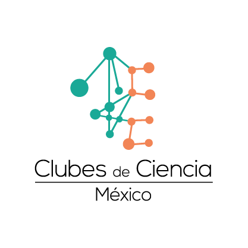

#  “¡Bienvenidos a Horripilandia! El sistema insostenible. Aquí los microplásticos protagonizan nuestros océanos”.
## Club 10: Océanos sustentables para todos.
             
Puede utilizar el [editor en GitHub](https://github.com/CdeCMx-org/templates_paginaweb/edit/main/README.md) para mantener y obtener una vista previa del contenido de su sitio web en archivos Markdown. Siempre que guardes los cambios en este repositorio, GitHub Pages ejecutará [Jekyll](https://jekyllrb.com/) para reconstruir las páginas de su sitio, a partir del contenido de sus archivos Markdown. Puedes escoger otro template en la siguiente página [repository settings](https://github.com/CdeCMx-org/templates_paginaweb/settings/pages). El tema de este template fue guardado en `_config.yml`.

El URL generado de tu página lo puedes encontrar en Settings -> Pages. 

*Puedes ver los cambios reflejados en la página, solo toma en cuenta que puede tomar unos minutos en cambiar.*

### Introducción  

Describe de qué trata tu proyecto:
* ¿Qué problema vas a abordar?
* ¿Por qué es importante?
* ¿Cómo se relaciona con la **ODS** asignada a tu club? 
* ¿Cómo se relaciona lo aprendido en tu club para resolver el problema que planteaste?
*
¿Cómo impactó/impacta en la economía con datos ($)? y ¿Cuál es la perspectiva futura del comercio pesquero?
Los efectos sobre la economía que se producen por causa de las basuras marinas, figuran las necesidades de limpieza de las playas por parte de las autoridades locales, sobre todo en el periodo estival y, que suponen millones de euros, (en lugares como Europa) afectando a diversos sectores económicos relacionados con el ocio, ya que el plástico tiene un impacto negativo sustancial en la recreación experiencial. Los usuarios recreativos de las costas están expuestos con mayor frecuencia al plástico, provocando un impacto en el bienestar de los usuarios. Debido a que la basura en la orilla no es nada agradable, ocasionado que sea una razón por la cual los visitantes pasarán menos tiempo en estos entornos. Ocasionando que hayan pérdidas de ingreso por turismo. 
De igual manera el sector productivo como la pesca comercial tiene un efecto económico importante (Rojo-Nieto, 2017). Sin embargo el costo económico en el sector de la pesca no se sabe con certeza, ya que esta dependerá de la concentración de los microplásticos que poseen los actuales recursos marinos, ya que el costo por tonelada de plástico variará dependiendo del lugar de emisión, hacia dónde se mueve y se acumula, su tamaño y tipo, y la cantidad que ya existe en el ecosistema. También es importante tomar en cuenta los datos ecológicos, por ejemplo, dentro de un tema ecológico hay muchas especies, las cuales tienen contribuciones variables a la provisión de servicios ecosistémicos. Por lo tanto, en un futuro el comercio pesquero debe tomar en cuenta qué especie de pez es el menos afectado al ingerir microplásticos, dentro del área dónde se lleva a cabo la actividad pesquera de su región (Beaumont, 2019).

¿Sólo los problemas están en los alimentos de origen marino?
El problema, no son los alimentos de origen marino. Sino el alto consumo y la falta de una norma clara de disposición del plástico, ocasionando el incremento y su presencia en el ambiente marino. El tamaño de los microplásticos, los cuales pueden llegar a tener un tamaño menor a 5 mm, hace que sea imposible rastrear su origen y por ende dificulta su extracción del ambiente acuático marino. Por lo cual, la única estrategia publicada que existe hasta el momento, adecuada para afrontar este problema, corresponde a una estrategia de mitigación, que consiste en la reducción de desechos plásticos en tierra (Jambeck et al., 2015). 

¿Economía circular marina?
El océano aporta el 50 % de nuestro oxígeno, absorbe el 30 % del CO2 producido por las actividades humanas y contiene la mayor biodiversidad del planeta, el océano desempeña una función muy importante para la vida en tierra. La ONU estima que el 40 % de los océanos se ve seriamente afectado por las actividades humanas, por contaminación, sobrepesca o pérdida de hábitats costeros. Más del 50 % del agua residual se vierte directamente en el mar sin tratamiento y el 80 % de los residuos son de plásticos. Uno de los puntos clave para poder hacerle frente a este problema es la responsabilidad ampliada del productor (RAP), el cual traslada a los fabricantes el coste de la gestión de los residuos que generarán los productos que ponen en el mercado. La Unión Europea resume este concepto con el principio de “quien contamina paga”. El objetivo es garantizar que no se generen daños al medioambiente a través de una correcta gestión de los residuos, pero sin que el coste repercuta en la administración y en los ciudadanos que no consumen el producto (AITEX, 2021).

“Es una medida esencial, pero a los fabricantes les sigue costando entrar en esta esfera. Hoy el recojo representa a la vez un elemento clave y el punto débil de la cadena de responsabilidad.”

La contaminación de los océanos, está directamente relacionada con sus actividades de gestión de residuos y de saneamiento de las aguas residuales. Para avanzar en el tema, se debe detener la contaminación (aguas residuales y residuos) que llega de la tierra a mares y océanos. Y pasar de una lógica de economía lineal a una lógica circular, actuando en la interfaz tierra-mar y remontando a la fuente de la contaminación. 

Su enfoque se estructura en tres niveles complementarios:

Tratar los flujos de contaminación terrestre en el litoral y aguas arriba (limpiar la zona de costa, tratar las aguas residuales para limitar los residuos en el mar).
Prevenir la contaminación marina, diseñando sistemas de prevención y gestión dinámica de los flujos que permitan aumentar la resiliencia de las ciudades y de los territorios.
Transformar los sistemas de producción y hábitos de consumo para dirigirse hacia una economía circular (VEOLIA, 2018).
Si bien recoger los plásticos y cualquier tipo de basura que se encuentre en nuestro entorno, no será la solución al problema de mitigar los microplásticos. Tanto los consumidores como los productores, debemos de trabajar en equipo para poder gestionar los recursos naturales en pro a obtener una economía circular para el desarrollo sostenible.

### Métodología

Describe los pasos específicos que tomaste para realizar tu proyecto. Trata de hacer una descripción concreta y detallada. Si aplica, puedes incluir un diagrama describiendo el procedimiento. 

### Resultados

Este es el momento en que nos compartas los resultados obtenidos en tu proyecto. Asegurate de incluir material visual (gráficas, fotos, diagramas, tablas). 

Puedes inster imagenes utilizando Markdown ``.

O utilizando codigo html ``, la ventaja de utilizar html es que le puedes modificar el tamaño utilizando **width**.

### Conclusiones

Comparte tus observaciones, lo aprendedido, limitaciones y siguientes pasos. 

### Video
 1. Para insertar un video de YouTube, en la página de YouTube del video selecciona compartir y selecciona el código de html.
 <iframe width="560" height="315" src="https://www.youtube.com/embed/PLj1-CMNERM" title="YouTube video player" frameborder="0" allow="accelerometer; autoplay; clipboard-write; encrypted-media; gyroscope; picture-in-picture" allowfullscreen></iframe>
 
 2. Insertar el link de tu video en YouTube, [nuestro video](https://youtu.be/rmXvlBPq24Q).
 4. Puedes subir el archivo de tu video directamente a Github [instrucciones aquí](https://stackoverflow.com/questions/4279611/how-to-embed-a-video-into-github-readme-md)
 
### Equipo Club_10_1

* Amelia Estefania López Moreno
* Brenda Berenice Ramos Hernández
* Nicte Alejandra Rojas Valentín
* Starling Villar Prensa
* Verónica Torres Solórzano

